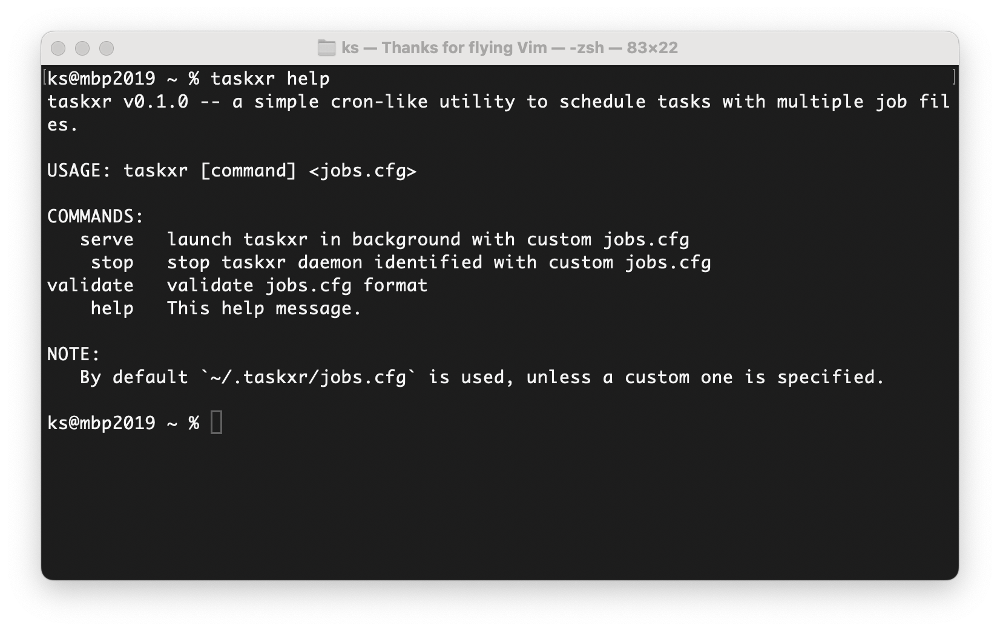

# TaskXr
Task Executor. A simple cron-like utility to schedule tasks with multiple job files.



You can launch multiple instances of TaskXr with different `jobs.cfg` files. Thus, you may group your jobs by purpose and have multiple instances running, which is quite convenient. 

## Jobs format
The `jobs.cfg` file follows the crontab format. For now, TaskXr supports just the minimal version: it does not support ranges, lists and steps.

### Example
```c
* * * * * echo "Job 1 runs every minute $(date)" >> ~/Desktop/job.txt
2 * * * * echo "Job 2 runs every hour at 2nd minute $(date)" >> ~/Desktop/job.txt
10 14 * * * echo "Job 4 runs every day at 14:10 $(date)" >> ~/Desktop/job.txt
0 0 * * 0 echo "Job 5 runs every Sunday at midnight $(date)" >> ~/Desktop/job.txt
```

## Installation
### Requirements
* C compiler
* CMake

### Install from source
#### Clone
```sh
git clone --recurse-submodules https://github.com/kirillsaidov/taskxr.git
cd taskxr/
```

#### Build
```sh
./build.sh  # linux, macos (or bash build.bash)
./build.bat # windows
```
You will find the executable inside the `bin/` folder. 

## LICENSE
All code is licensed under the MIT license.

